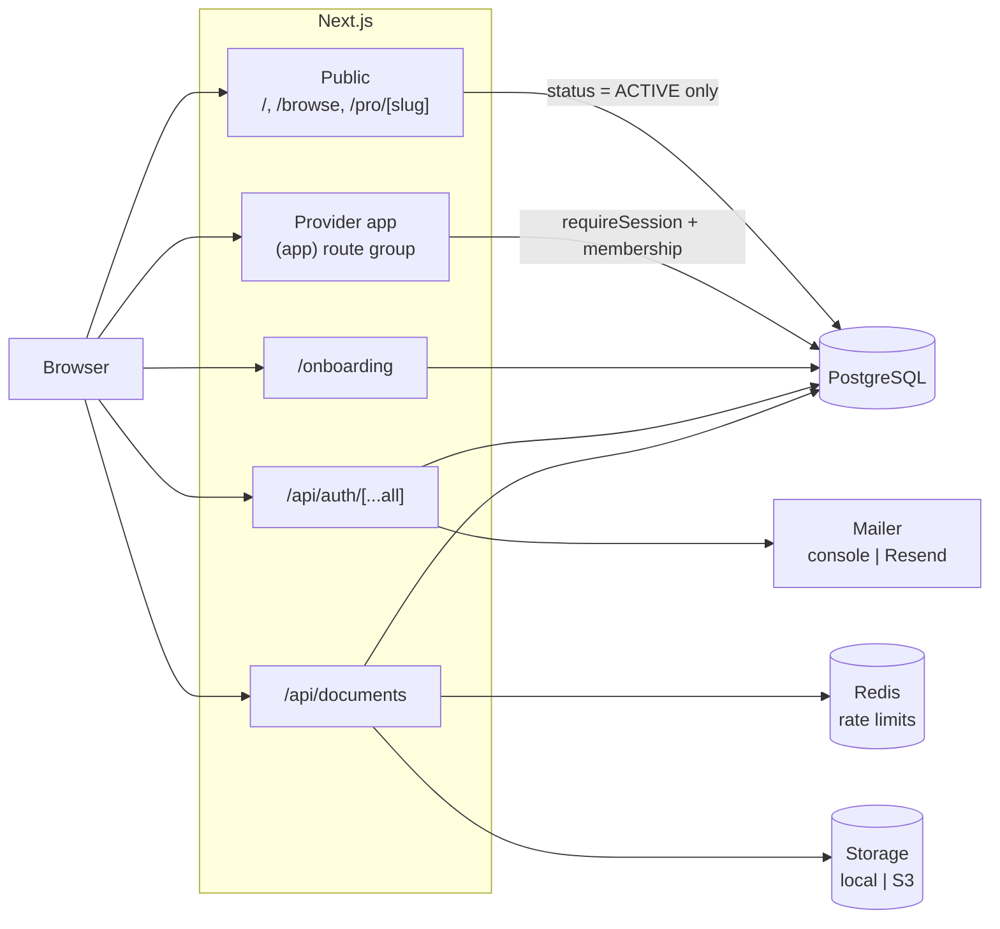
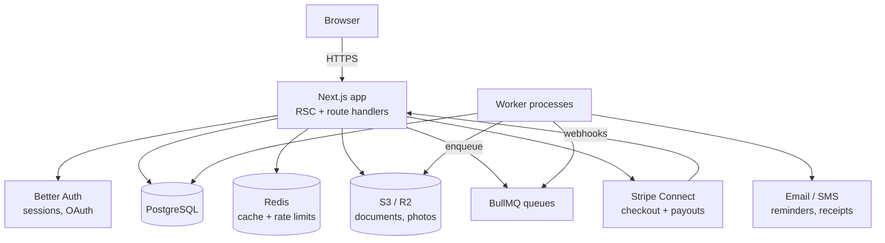

# Architecture

## Current state (after Milestone 4)

Roost is a single Next.js application backed by PostgreSQL, Redis, and an
object store. The App Router serves three surfaces from one deployable: the
public marketplace, the auth pages, and the session-protected provider app.

Two boundaries do the security work:

- **`requireSession` → `currentMembership` → `requireMembership`/`requireEditor`.**
  Authentication says who you are; membership says which business you may act
  for. No service function trusts a `businessId` from a request body.
- **`src/server/businesses/public.ts`** is the only module unauthenticated
  requests reach, and every query in it filters `status: ACTIVE` and selects
  an explicit column list.

See [storefront.md](storefront.md) for the provider lifecycle these enforce,
[scheduling.md](scheduling.md) for how bookable slots are produced, and
[booking.md](booking.md) for how one is claimed.

A third boundary joins them in Milestone 4: **the database owns
non-overlap**. Two customers cannot hold the same slot because a Postgres
exclusion constraint says so, not because application code checked first —
see [booking.md](booking.md#double-booking-is-prevented-by-the-database).

## Target architecture

The end-state the milestones build toward:

Key properties:

- **One web deployable.** All request/response work lives in Next.js. Anything
  that outlives a request — booking reminders, invoice emails, payout
  reconciliation, document-expiry checks — is enqueued to BullMQ and executed
  by separate worker processes sharing the same codebase and Prisma client.
- **Postgres is the source of truth.** Redis is disposable: cache, queues,
  rate-limit counters.
- **Money moves through Stripe Connect**, never through our own ledger:
  customers pay the platform, the platform pays out to the provider's
  connected account, and webhooks are the authority on what settled.

## Design system

- Tokens live in `src/app/globals.css` as CSS variables (oklch), mapped into
  Tailwind via `@theme inline`. Components never hardcode colors.
- Dark mode is the default theme (`next-themes`, class strategy); light mode
  mirrors the palette at inverted lightness. Brand hue 285 (violet) is
  reserved for primary actions; surfaces stay near-neutral.
- shadcn/ui primitives are generated into `src/components/ui/` and treated as
  owned code, but customizations belong in wrapper components, not the
  generated files.

## Server layer

`src/server/` holds framework-agnostic server code, kept out of route handlers
so it stays testable and extractable ([ADR-0001](adr/0001-nextjs-fullstack.md)):

| Module                       | Responsibility                                              |
| ---------------------------- | ----------------------------------------------------------- |
| `db.ts`                      | Prisma singleton (globalThis-cached against dev HMR)        |
| `auth.ts`                    | Better Auth configuration: sessions, rate limits, providers |
| `session.ts`                 | `getSession` (request-cached) and the `requireSession` gate |
| `mailer.ts`                  | `Mailer` interface + console/Resend transports              |
| `storage/`                   | `Storage` interface + local/S3 drivers                      |
| `businesses/`                | Access gates, business service, documents, public reads     |
| `businesses/availability.ts` | Pure slot generation + hours/closure persistence            |
| `queue/`                     | Redis connection and BullMQ queues                          |
| `rate-limit.ts`              | Redis fixed-window limiter for expensive endpoints          |

Swappable dependencies are expressed as interfaces with a factory that picks
the implementation from configuration (`createMailer`). The same pattern will
carry storage (S3/R2), the vector store, and AI providers.

## Conventions

- `src/lib/env.ts` is the only place `process.env` is read on the server;
  everything else calls the validated `serverEnv()`.
- `src/lib/site-config.ts` owns product identity and navigation.
- `src/lib/time.ts` is the only place wall-clock ↔ instant conversion happens;
  nothing else should do timezone arithmetic ([scheduling.md](scheduling.md)).
- Route groups: `(app)` wraps everything behind the auth gate, which also
  redirects a user without a business to `/onboarding`.
- Tests live next to the code they cover (`*.test.ts[x]`), with shared setup
  in `src/test/setup.ts`.
