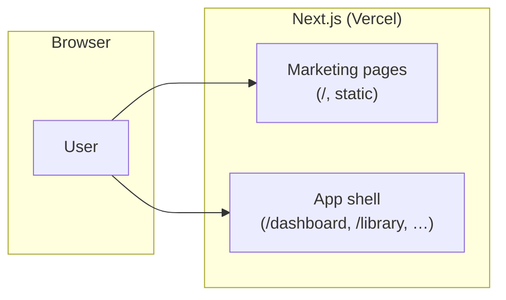
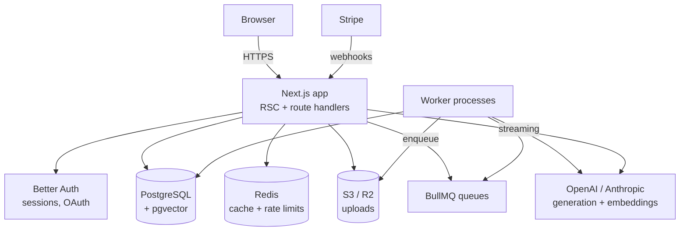

# Architecture

## Current state (after Milestone 1)

StudyForge is a single Next.js application. The App Router serves both the
marketing site and the authenticated app shell; there is no database or
external service yet.

## Target architecture

The end-state the milestones build toward:

Key properties:

- **One web deployable.** All request/response work lives in Next.js. Heavy or
  slow work (document parsing, OCR, embedding, batch generation) is enqueued to
  BullMQ and executed by separate worker processes that share the same
  codebase and Prisma client.
- **Postgres is the source of truth** for relational data _and_ vectors
  (pgvector). Redis is disposable: cache, queues, rate-limit counters.
- **AI calls stream** from route handlers to the client; workers handle
  anything that outlives a request.

## Design system

- Tokens live in `src/app/globals.css` as CSS variables (oklch), mapped into
  Tailwind via `@theme inline`. Components never hardcode colors.
- Dark mode is the default theme (`next-themes`, class strategy); light mode
  mirrors the palette at inverted lightness. Brand hue 285 (violet) is
  reserved for primary actions; surfaces stay near-neutral.
- shadcn/ui primitives are generated into `src/components/ui/` and treated as
  owned code, but customizations belong in wrapper components, not the
  generated files.

## Conventions

- `src/lib/env.ts` is the only place `process.env` is read on the server;
  everything else imports the validated `env` object.
- `src/lib/site-config.ts` owns product identity and navigation.
- Route groups: `(app)` wraps everything behind the (future) auth gate.
- Tests live next to the code they cover (`*.test.ts[x]`), with shared setup
  in `src/test/setup.ts`.
