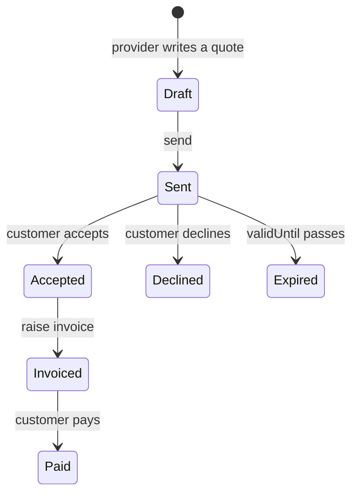

# Quotes & invoicing

How work that couldn't be priced online gets priced, agreed, and paid for.

## The chain



`/quotes` → the customer's `/quote/<reference>` → `/invoices` → the
customer's `/invoice/<reference>`. As with bookings, the customer needs no
account: holding the reference is the authorisation.

## Money is integer arithmetic, end to end

`src/lib/money.ts` is the only place a total is computed, and it is pure.
Quantities are **hundredths of a unit** (`250` is 2.5 hours), prices are
cents. Nothing is ever a float.

Two rules that stop the classic "off by a cent" complaint:

- **Each line is rounded once, then summed.** Summing unrounded values and
  rounding the total would print lines that do not add up to the printed
  total. A test asserts three lines of 3.333 cents come to 9, not 10.
- **Halves round away from zero**, so a credit line reverses the charge it
  offsets exactly. `Math.round` sends −0.5 to −0 and would not.

The editor computes its running total with the _same_ functions the server
uses. A second implementation in the UI would eventually disagree with the
stored figure, and the customer would see one number while the database held
another.

## A sent document cannot be rewritten

Only a `DRAFT` can be edited or deleted. Once sent, the customer holds a
document, and withdrawing it is a decline or a void — never a silent edit.
Lines are replaced wholesale rather than diffed, so totals can never drift
out of step with the rows they came from.

Invoicing an accepted quote **copies** the lines and totals as accepted. Any
re-derivation would let a price change after the customer agreed to it.

## Invoice numbers

Sequential per business, from an `invoiceCounter` column incremented in
place:

```ts
data: {
  invoiceCounter: {
    increment: 1;
  }
}
```

That compiles to `SET "invoiceCounter" = "invoiceCounter" + 1`, which takes a
row lock, so concurrent invoices serialise and each gets a distinct number.

The obvious alternative — `MAX(number) + 1` — is read-then-write, and a test
here demonstrated exactly how it fails: six concurrent invoices all read the
same maximum, then fight over one number until the retries run out.

Numbers are never reused, including by a voided invoice. Bookkeeping expects
a sequence that only goes up, which is also why an issued invoice is voided
rather than deleted.

## Expiry is checked on read, not trusted from the status

A quote with a `validUntil` in the past cannot be accepted even if no sweep
has marked it `EXPIRED` yet — `answerQuote` compares the date itself and
flips the status on the way past. Trusting a stored status would leave a
window where a stale quote was still acceptable at yesterday's price.

## Payment

An invoice is paid through the same Stripe Connect checkout as a booking:
hosted, on the connected account, with the platform fee applied. The amount
charged is the **outstanding balance**, so a part payment can be topped up,
and the idempotency key includes that balance — a retry for the same
remainder reuses the session, but a genuinely different amount does not.

A `checkout.session.completed` webhook settles either a booking payment or an
invoice; the handler tries the payment row first and falls through to
invoices. Only a fully settled invoice becomes `PAID` — a part payment stays
`SENT` with a balance rather than looking closed.

With no Stripe keys, or a business that hasn't connected, the invoice page
says the business will arrange payment directly instead of offering a button
that cannot work.

## What the customer never sees

`getPublicQuote` and `getPublicInvoice` select explicit column lists. Neither
returns the internal id, the customer's own stored contact details, or —
for quotes — `internalNote`, which is where a provider writes "awkward
crawlspace, quote high".

Both pages are `noindex` and reject a malformed reference before touching the
database.

## Not yet

- **No PDF.** Documents are web pages and plain-text email.
- **No deposits taken.** A quote can state a deposit and it is shown, but
  nothing collects it yet — accepting does not charge.
- **No editing after send.** Correcting a sent quote means a new one.
- **No reminders** for an unanswered quote or an overdue invoice. The worker
  exists, so both are small additions.
- **No booking created on acceptance.** Accepting a quote does not yet
  schedule the work; the provider arranges it.
