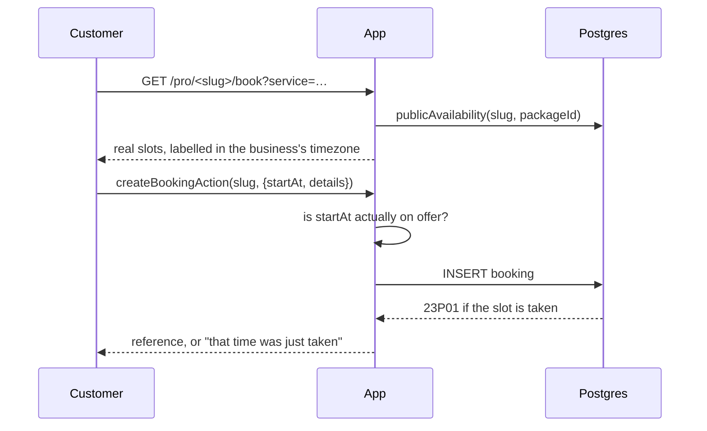
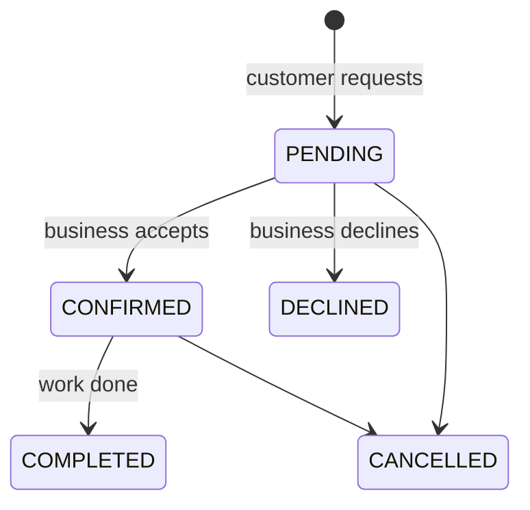

# Booking

How a customer's click becomes a job on a provider's schedule, and why two of
them can never land on the same hour.

## The flow



`/pro/<slug>` → `/pro/<slug>/book` → `/booking/<reference>`. No account is
required: a homeowner should not have to sign up to hire someone. When they
happen to be signed in, the booking is linked to their account.

## Double booking is prevented by the database

An application-level "check then insert" cannot be correct. Two requests can
both read a free slot before either writes, and no amount of care in
JavaScript closes that window — there is no serialization point.

So the guarantee lives in Postgres, as an exclusion constraint:

```sql
ALTER TABLE "booking"
  ADD CONSTRAINT "booking_no_overlap"
  EXCLUDE USING gist (
    "businessId" WITH =,
    tstzrange("startAt", "endAt", '[)') WITH &&
  )
  WHERE (status IN ('PENDING', 'CONFIRMED'));
```

Details that matter:

- **`btree_gist`** is required, so a GiST index can mix the equality column
  (`businessId`) with the range column.
- **`startAt`/`endAt` are `timestamptz`.** Prisma's default `timestamp`
  without a zone makes `tstzrange(...)` non-immutable, and Postgres refuses
  to index it. These are instants, so the zone belongs there anyway.
- **`'[)'`** is half-open: a job may start exactly when the previous one
  ends. The availability engine uses the same rule, so the two agree.
- **The `WHERE` clause** means declined, cancelled, and completed bookings
  release their time. A declined request must not hold a slot hostage.

`createBooking` catches SQLSTATE `23P01` and reports `SlotUnavailableError`.
Prisma has no error code for exclusion constraints — it reports `P2039` and
buries the real SQLSTATE at `meta.driverAdapterError.cause.code`, so the
detector reads that path _and_ falls back to matching the constraint name.

## Two guards, not one

The constraint settles races. It does not stop a caller from posting a
plausible-looking timestamp, so `createBooking` also asks the availability
engine whether the instant is genuinely offered. Without that check, a
crafted request could book 3am, a closed Sunday, or a time inside the
business's notice period — all of which the constraint would happily accept.

Availability itself subtracts live bookings (`PENDING` and `CONFIRMED`, the
same set the constraint uses). If those two lists ever disagreed, the UI
would offer slots the insert then rejects.

## Booking references

The reference is the customer's only handle on their booking, and
`/booking/<reference>` shows an address and a service. It is therefore a
bearer token:

- Generated from `randomBytes`, never `Math.random`.
- 8 characters from a 28-letter alphabet that omits `I/1`, `O/0`, `S/5`, and
  `Z/2` — the pairs people misread when reading a code aloud.
- Rejection-sampled, so no letter is favoured by modulo bias.
- The page is `noindex`, and a malformed reference 404s before the database
  is touched.

## Service details are copied, not referenced

A booking stores `packageName`, `pricingModel`, `priceCents`,
`durationMinutes`, and `timezone` as they were when it was made. A business
that later reprices or deletes a service must not rewrite what a customer
already agreed to. `packageId` is kept as a soft link and nulls out if the
service is deleted.

## Lifecycle



Transitions are a table (`ALLOWED_TRANSITIONS`) rather than scattered
conditionals, so the whole lifecycle is readable in one place and a new
caller cannot reach an illegal state. Anything else raises
`InvalidTransitionError`. Only `OWNER` and `ADMIN` may respond.

## Abuse and privacy

- Booking submission is unauthenticated, so it is **rate limited per client
  address** (`RATE_LIMITS.booking`). Proxy headers are forgeable, so the
  address only ever narrows a bucket — a forged value costs the forger their
  own quota.
- `getBookingByReference` selects an explicit column list that excludes the
  customer's email and phone: the reference proves you made the booking, not
  that you should get a contact dump back.
- The booking form states plainly that the address is shared with the
  business, before it is submitted.
- Notification mail is sent **after** the booking is committed and its
  failure is caught and logged: a mail outage must not lose a real job. The
  customer's copy omits their own phone number; the provider's carries what
  they need to turn up.

## Not yet

- **No payment.** Milestone 5 adds Stripe Connect; until then a booking is a
  commitment, not a transaction.
- **Customers cannot cancel.** Only the business can, from `/schedule`.
- **No reminders.** These need the worker (Milestone 5).
- **No calendar view.** `/schedule` is a list; Milestone 6 makes it a
  calendar and adds job assignment.
