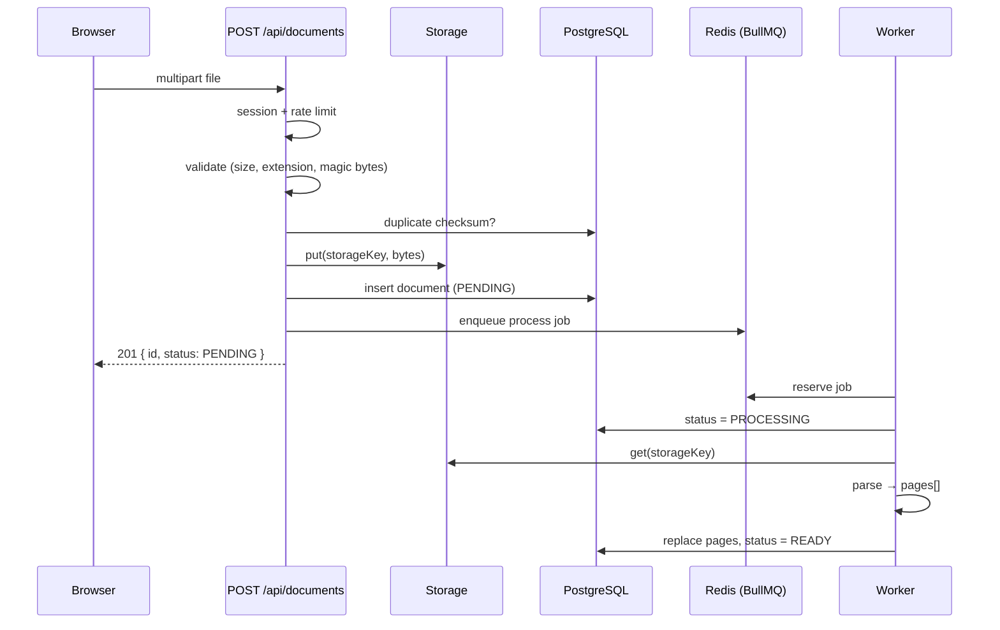

# Content pipeline

How an uploaded file becomes study material.



## Upload validation

Every check lives in `src/server/documents/validate-upload.ts` and runs before
a single byte is stored:

| Check        | Rule                                                           |
| ------------ | -------------------------------------------------------------- |
| Size         | `MAX_UPLOAD_MB` (default 25); `content-length` screened first  |
| Extension    | Allowlist in `file-types.ts` — anything else is rejected       |
| **Content**  | Magic bytes must match the extension (`file-type`)             |
| Text formats | Must decode as UTF-8 with no null bytes                        |
| Filename     | Never used as a path; title is sanitized for display only      |
| Duplicates   | SHA-256 checksum, unique per user                              |
| Destination  | Class/folder must belong to the uploading user (prevents IDOR) |

The browser-supplied MIME type is **never trusted**. A `.pdf` containing an
ELF binary is rejected by content sniffing, which is covered by tests.

Storage keys are `<userId>/<uuid>.<ext>` — generated server-side, never
derived from the filename, and validated by `assertSafeKey` before touching
the filesystem or bucket.

## Storage drivers

`createStorage()` selects a driver from configuration:

- **LocalStorage** (default) writes under `.storage/`. Writes go to a temp
  file and are renamed, so a crash cannot leave a half-written object
  readable. Development needs no cloud account.
- **S3Storage** activates when `S3_BUCKET`, `S3_ACCESS_KEY_ID`, and
  `S3_SECRET_ACCESS_KEY` are set. Works with AWS S3 and, with `S3_ENDPOINT`,
  Cloudflare R2 or MinIO. Objects are stored with
  `Content-Disposition: attachment` so user content can never render inline
  from the bucket origin.

## Parsers

| Kind    | Library        | Page unit                       |
| ------- | -------------- | ------------------------------- |
| PDF     | `unpdf`        | Real PDF pages                  |
| DOCX    | `mammoth`      | ~450 words, split on paragraphs |
| PPTX    | `jszip`        | One page per slide              |
| TEXT/MD | built-in       | ~450 words, split on paragraphs |
| IMAGE   | `tesseract.js` | One page (OCR)                  |

Word documents and plain text have no inherent pages, so they are paginated
on paragraph boundaries — never mid-sentence — to give citations a stable,
coherent unit.

Parse failures raise `ParseError` with a message written for a student
("No selectable text found. If this is a scan, upload it as an image…"), which
is what lands in `document.processingError`. Internal errors are replaced with
a generic message so stack traces never reach the UI.

## Queue and worker

- Queue: `document-processing` on Redis via BullMQ.
- Jobs are deduplicated by `documentJobId(id)` → `document-<id>`.
  **BullMQ rejects custom job ids containing `:`** — hence the hyphen.
- 3 attempts with exponential backoff; failures retained for 7 days.
- `processDocument` is idempotent: it deletes and rewrites pages in one
  transaction, so a retry cannot duplicate text.
- The worker drains in-flight jobs on `SIGTERM`/`SIGINT` so a deploy does not
  orphan work.

Run it alongside the web app:

```bash
npm run worker
```

## Rate limiting

Uploads cost storage and OCR CPU, so `/api/documents` is limited to 30
uploads per 10 minutes per user via a Redis fixed-window limiter
(`src/server/rate-limit.ts`). Unlike Better Auth's in-memory limiter, this one
is shared across instances — Milestone 9 will migrate auth limits onto it.

## Known limitations

- The upload route buffers the whole file in memory (bounded by
  `MAX_UPLOAD_MB`). Streaming multipart parsing would be needed for
  substantially larger files.
- `unpdf` logs `Math.sumPrecise is not a function` on Node 24; extraction is
  unaffected.
- OCR is English-only (`eng` traineddata). Additional languages are a config
  change in `parsing/image.ts`.
- Soft-deleted documents keep their stored objects until a purge job exists
  (scheduled with the rest of the retention work).
