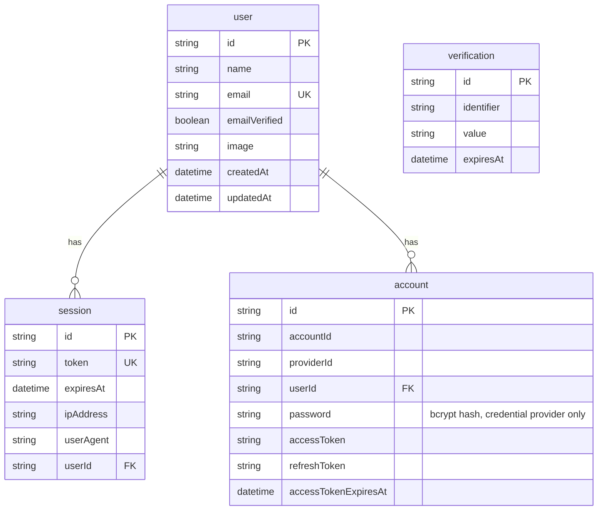

# Database

PostgreSQL 18, accessed through Prisma 7.

## Schema

Authentication tables are generated and owned by Better Auth's CLI. Domain
tables are hand-written in the same file.

> ⚠️ `npx @better-auth/cli generate` **overwrites `schema.prisma`**. After
> running it, re-add the domain models and the `User.memberships`
> back-relation — there is a comment in the file marking them.

```mermaid
erDiagram
    user ||--o{ business_member : "holds seat"
    business ||--o{ business_member : "has seats"
    business ||--o{ business_category : offers
    business ||--o{ service_area : serves
    business ||--o{ business_document : "proves with"
    business ||--o{ service_package : sells
    business ||--o{ business_hour : "opens during"
    business ||--o{ availability_exception : "closes on"
    service_category ||--o{ business_category : "offered via"
    service_category ||--o{ service_package : classifies
    business ||--o{ booking : receives
    service_package ||--o{ booking : "sold as"
    booking ||--o| payment : "paid by"
    business ||--o| subscription : "pays Roost via"
    business ||--o{ quote : issues
    business ||--o{ invoice : issues
    quote ||--o{ quote_line : "priced by"
    quote ||--o| invoice : "billed as"
    invoice ||--o{ invoice_line : "charged by"

    business {
        string id PK
        string slug UK "public storefront address"
        string name
        string tagline
        string about
        string phone
        string email
        string website
        string logoKey
        enum status "DRAFT PENDING_REVIEW ACTIVE SUSPENDED"
        datetime verifiedAt
        datetime insuredUntil
        string timezone "IANA; what wall-clock hours mean"
        int bookingLeadHours
        int bookingHorizonDays
    }
    service_package {
        string id PK
        string businessId FK
        string name
        string description
        string categoryId FK "nullable, SetNull"
        enum pricingModel "FIXED HOURLY QUOTE"
        int priceCents "integer cents; null only when QUOTE"
        int durationMinutes "slot length"
        int bufferMinutes "reserved after the job"
        boolean active
        int position
    }
    business_hour {
        string id PK
        string businessId FK
        int weekday "0 = Sunday"
        int startMinute "from midnight, business-local"
        int endMinute
    }
    availability_exception {
        string id PK
        string businessId FK
        date date "whole-day closure"
        string note
    }
    booking {
        string id PK
        string reference UK "customer's handle; a bearer token"
        string businessId FK
        string packageId FK "soft link, SetNull"
        string packageName "snapshot: prices change, history must not"
        enum pricingModel
        int priceCents
        int durationMinutes
        timestamptz startAt "timestamptz for the exclusion constraint"
        timestamptz endAt
        string timezone "snapshot of the business's zone"
        enum status "PENDING CONFIRMED DECLINED CANCELLED COMPLETED"
        string userId FK "nullable — guests may book"
        string customerName
        string customerEmail
        string customerPhone
        string addressLine1
        string city
        string region
        string postalCode
        string notes
        string assignedToId FK "BusinessMember, SetNull"
        string internalNote "never shown to the customer"
        datetime reminderSentAt "idempotency marker for the reminder sweep"
    }
    payment {
        string id PK
        string bookingId UK "one payment per booking"
        string stripeCheckoutSessionId UK
        string stripePaymentIntentId UK
        string stripeAccountId "the connected account"
        int amountCents "integer cents, always"
        int platformFeeCents
        string currency
        enum status "PENDING SUCCEEDED FAILED REFUNDED"
        int refundedCents
        datetime paidAt
    }
    subscription {
        string id PK
        string businessId UK "one per business"
        string stripeCustomerId UK
        string stripeSubscriptionId UK "null until checkout completes"
        enum tier "PRO PREMIUM"
        enum status "ACTIVE TRIALING PAST_DUE CANCELED INCOMPLETE"
        datetime currentPeriodEnd "mirror of Stripe; not in any constraint"
        boolean cancelAtPeriodEnd
    }
    quote {
        string id PK
        string reference UK "customer's handle"
        string businessId FK
        enum status "DRAFT SENT ACCEPTED DECLINED EXPIRED"
        int subtotalCents "stored, matching the lines as sent"
        int taxRateBps
        int taxCents
        int totalCents
        int depositCents
        string internalNote "never shown to the customer"
        timestamptz validUntil
    }
    quote_line {
        string id PK
        string quoteId FK
        string description
        int quantityHundredths "250 is 2.5 units"
        int unitPriceCents
        int position
    }
    invoice {
        string id PK
        string reference UK
        int number "sequential per business, never reused"
        string businessId FK
        string quoteId FK "unique; one invoice per quote"
        string bookingId FK
        enum status "DRAFT SENT PAID VOID"
        int totalCents
        int amountPaidCents "below total means part-paid"
        timestamptz dueAt
    }
    stripe_webhook_event {
        string id PK "Stripe's event id; the insert is the idempotency lock"
        string type
        datetime processedAt
    }
    business_member {
        string id PK
        string businessId FK
        string userId FK
        enum role "OWNER ADMIN MEMBER"
    }
    service_category {
        string id PK
        string slug UK "stable, used in public URLs"
        string name
        string description
        int position "display order"
    }
    business_category {
        string businessId FK
        string categoryId FK
    }
    service_area {
        string id PK
        string businessId FK
        string city
        string region "province or state"
        string country "ISO-3166-1 alpha-2, default CA"
    }
    business_document {
        string id PK
        string businessId FK
        enum kind "LICENCE INSURANCE OTHER"
        string title "sanitized filename, display only"
        string storageKey UK "generated, never user input"
        string mimeType "from magic bytes, not the browser"
        int sizeBytes
        enum status "PENDING APPROVED REJECTED"
        string reviewNote
        datetime reviewedAt
        datetime expiresAt
        string uploadedById
    }
```



`Business` is the tenant boundary: every domain row hangs off it, and every
query is scoped by a membership check rather than by `userId`. Deleting a
business cascades to its seats, trades, areas, and documents; deleting a user
removes their seats but leaves the business standing, so a departing team
member cannot take the company with them.

`(businessId, userId)` on `business_member`, `(businessId, city, region,
country)` on `service_area`, and `(businessId, date)` on
`availability_exception` are unique, which is what makes re-adding the same
city or closed day an idempotent no-op instead of an error.
`(businessId, weekday, startMinute)` is unique on `business_hour` so a day
cannot hold two windows that open at the same minute.
`(businessId, number)` is unique on `invoice`, and the number comes from
`business.invoiceCounter` incremented in place rather than from
`MAX(number)` — see [billing.md](billing.md#invoice-numbers).

`booking` additionally carries an **exclusion constraint**, which is the only
reason two customers cannot hold the same slot — see
[booking.md](booking.md#double-booking-is-prevented-by-the-database). It is
hand-written SQL appended to the generated migration, because Prisma cannot
express it. `service_area` is additionally
indexed on `(city, region, country)` — that index serves marketplace search.

### Authentication tables



`account` holds one row per sign-in method: the credential provider stores a
hashed password, OAuth providers store tokens. A user who signs up with email
and later links Google has two rows and one `user`.

## Local setup

This project uses a Homebrew-managed PostgreSQL, not Docker (Docker is not
installed on the current development machine).

```bash
brew install postgresql@18
brew services start postgresql@18
createdb roost
createdb roost_test
```

Then apply migrations:

```bash
npx prisma migrate dev
```

## Working with the schema

| Task                       | Command                                                     |
| -------------------------- | ----------------------------------------------------------- |
| Create + apply a migration | `npx prisma migrate dev --name <change>`                    |
| Apply migrations (CI/prod) | `npx prisma migrate deploy`                                 |
| Regenerate the client      | `npx prisma generate`                                       |
| Browse data                | `npx prisma studio`                                         |
| Regenerate auth models     | `npx @better-auth/cli generate --config src/server/auth.ts` |

Notes specific to Prisma 7:

- Configuration lives in `prisma.config.ts`, not in `schema.prisma`'s
  datasource block; `DATABASE_URL` is read there via `dotenv`.
- A **driver adapter is mandatory** — `src/server/db.ts` wires `@prisma/adapter-pg`,
  which also pins the session to UTC. That is load-bearing, not hygiene: see
  [operations.md](operations.md#timezones-and-the-database).
- The client generates into `src/generated/prisma` (gitignored, rebuilt by the
  `postinstall` script).

## Test database

`src/test/global-setup.ts` points the suite at `roost_test` (override with
`TEST_DATABASE_URL`) and runs `prisma migrate deploy` before any test, so
tests exercise the exact migration chain that ships to production. Integration
tests assert the database name contains `roost_test` before any destructive
cleanup.
