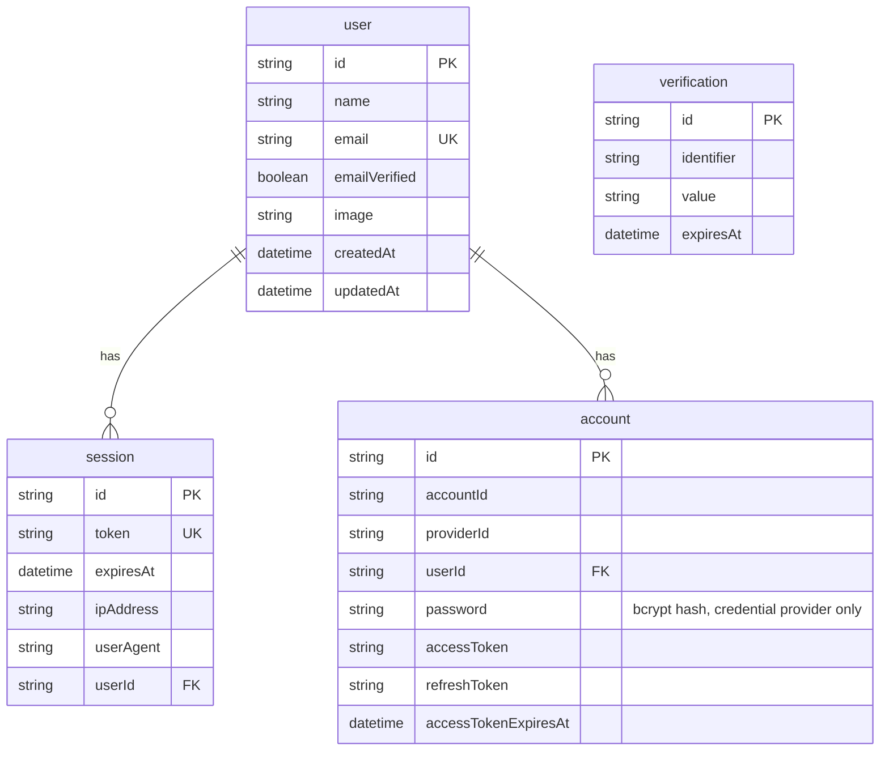

# Database

PostgreSQL 18 with the pgvector extension, accessed through Prisma 7.

## Schema (after Milestone 2)

Authentication tables are generated and owned by Better Auth's CLI; domain
tables (classes, documents, flashcards, …) arrive in Milestone 3.



`account` holds one row per sign-in method: the credential provider stores a
hashed password, OAuth providers store tokens. A user who signs up with email
and later links Google has two rows and one `user`.

## Local setup

This project uses a Homebrew-managed PostgreSQL, not Docker (Docker is not
installed on the current development machine).

```bash
brew install pgvector postgresql@18
brew services start postgresql@18
createdb studyforge
createdb studyforge_test
psql -d studyforge -c "CREATE EXTENSION IF NOT EXISTS vector;"
psql -d studyforge_test -c "CREATE EXTENSION IF NOT EXISTS vector;"
```

Then apply migrations:

```bash
npx prisma migrate dev
```

## Working with the schema

| Task                       | Command                                                     |
| -------------------------- | ----------------------------------------------------------- |
| Create + apply a migration | `npx prisma migrate dev --name <change>`                    |
| Apply migrations (CI/prod) | `npx prisma migrate deploy`                                 |
| Regenerate the client      | `npx prisma generate`                                       |
| Browse data                | `npx prisma studio`                                         |
| Regenerate auth models     | `npx @better-auth/cli generate --config src/server/auth.ts` |

Notes specific to Prisma 7:

- Configuration lives in `prisma.config.ts`, not in `schema.prisma`'s
  datasource block; `DATABASE_URL` is read there via `dotenv`.
- A **driver adapter is mandatory** — `src/server/db.ts` wires `@prisma/adapter-pg`.
- The client generates into `src/generated/prisma` (gitignored, rebuilt by the
  `postinstall` script).

## Test database

`src/test/global-setup.ts` points the suite at `studyforge_test` and runs
`prisma migrate deploy` before any test, so tests exercise the exact migration
chain that ships to production. Integration tests assert the database name
contains `studyforge_test` before any destructive cleanup.
