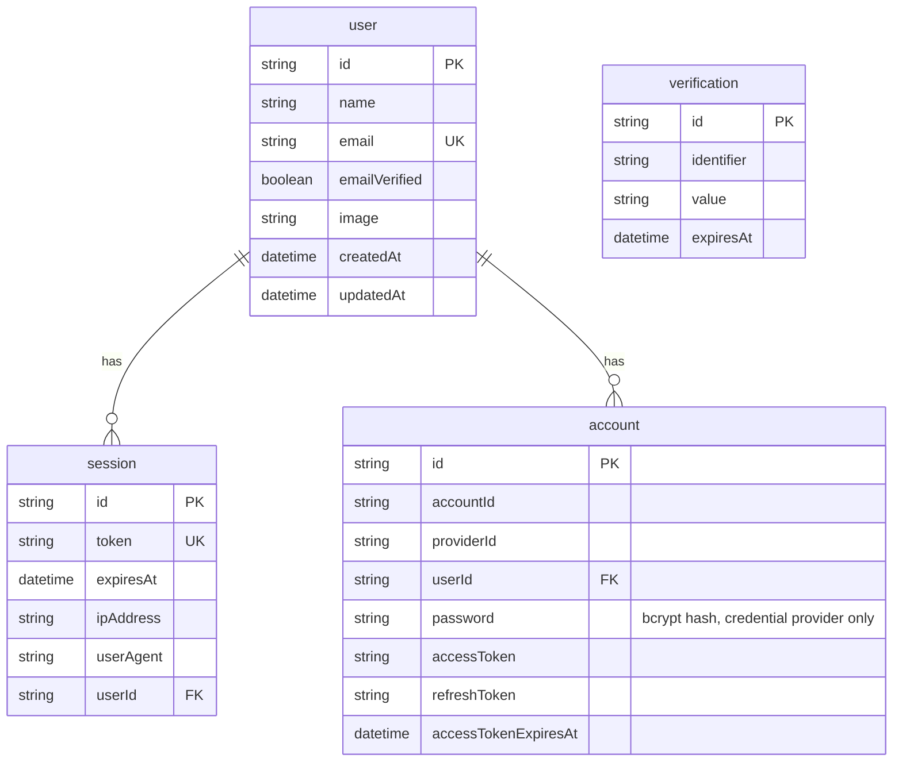

# Database

PostgreSQL 18 with the pgvector extension, accessed through Prisma 7.

## Schema

Authentication tables are generated and owned by Better Auth's CLI. Domain
tables are hand-written in the same file.

> ⚠️ `npx @better-auth/cli generate` **overwrites `schema.prisma`**. After
> running it, re-add the domain models and the `User` back-relations
> (`classes`, `folders`, `documents`, `tags`) — there is a comment in the file
> marking them.

```mermaid
erDiagram
    user ||--o{ class : owns
    user ||--o{ folder : owns
    user ||--o{ document : owns
    user ||--o{ tag : owns
    class ||--o{ folder : contains
    class ||--o{ document : contains
    folder ||--o{ folder : nests
    folder ||--o{ document : contains
    document ||--o{ document_page : "extracted into"
    document ||--o{ document_tag : has
    tag ||--o{ document_tag : applied_via

    document {
        string id PK
        string title
        enum kind "PDF DOCX PPTX TEXT MARKDOWN IMAGE"
        enum status "PENDING PROCESSING READY FAILED"
        string storageKey UK
        string checksum "sha256, unique per user"
        int sizeBytes
        int pageCount
        int wordCount
        string processingError
        boolean favorite
        datetime archivedAt
        datetime deletedAt "soft delete"
    }
    document_page {
        string id PK
        string documentId FK
        int pageNumber "1-based, for citations"
        string text
    }
    class {
        string id PK
        string name "unique per user"
        string color
        datetime archivedAt
    }
    folder {
        string id PK
        string name
        string classId FK "nullable"
        string parentId FK "self-relation"
    }
    tag {
        string id PK
        string name "unique per user"
        string color
    }
```

Deletion behaviour is deliberate: removing a user or class cascades to its
content, but deleting a class only _detaches_ its documents
(`onDelete: SetNull`) so a student never loses uploads by tidying up.

### Authentication tables



`account` holds one row per sign-in method: the credential provider stores a
hashed password, OAuth providers store tokens. A user who signs up with email
and later links Google has two rows and one `user`.

## Local setup

This project uses a Homebrew-managed PostgreSQL, not Docker (Docker is not
installed on the current development machine).

```bash
brew install pgvector postgresql@18
brew services start postgresql@18
createdb studyforge
createdb studyforge_test
psql -d studyforge -c "CREATE EXTENSION IF NOT EXISTS vector;"
psql -d studyforge_test -c "CREATE EXTENSION IF NOT EXISTS vector;"
```

Then apply migrations:

```bash
npx prisma migrate dev
```

## Working with the schema

| Task                       | Command                                                     |
| -------------------------- | ----------------------------------------------------------- |
| Create + apply a migration | `npx prisma migrate dev --name <change>`                    |
| Apply migrations (CI/prod) | `npx prisma migrate deploy`                                 |
| Regenerate the client      | `npx prisma generate`                                       |
| Browse data                | `npx prisma studio`                                         |
| Regenerate auth models     | `npx @better-auth/cli generate --config src/server/auth.ts` |

Notes specific to Prisma 7:

- Configuration lives in `prisma.config.ts`, not in `schema.prisma`'s
  datasource block; `DATABASE_URL` is read there via `dotenv`.
- A **driver adapter is mandatory** — `src/server/db.ts` wires `@prisma/adapter-pg`.
- The client generates into `src/generated/prisma` (gitignored, rebuilt by the
  `postinstall` script).

## Test database

`src/test/global-setup.ts` points the suite at `studyforge_test` and runs
`prisma migrate deploy` before any test, so tests exercise the exact migration
chain that ships to production. Integration tests assert the database name
contains `studyforge_test` before any destructive cleanup.
