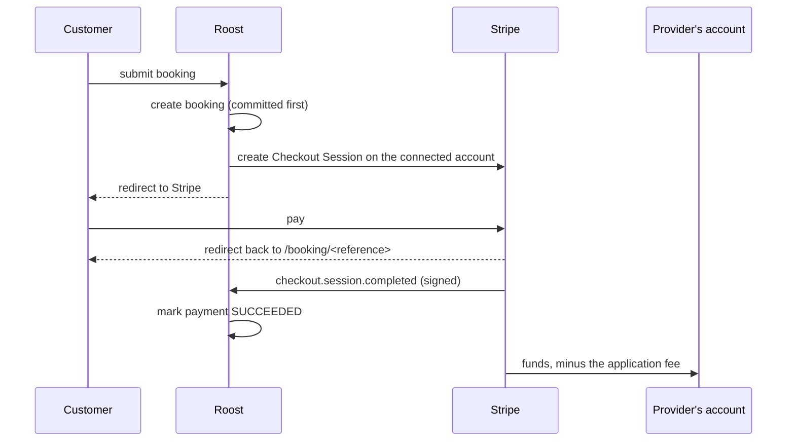

# Payments

Money moves through Stripe Connect. Roost never holds funds and never stores
a card number.

## Setting it up

Payments are **optional**. With no keys the app runs normally: providers
book, schedules work, and the settings page says payments are switched off.
Nothing throws.

To switch them on:

1. Create a Stripe account and copy the **test** keys from
   [the dashboard](https://dashboard.stripe.com/test/apikeys).
2. Put `STRIPE_SECRET_KEY=sk_test_…` in `.env`.
3. Run `stripe listen --forward-to localhost:3000/api/stripe/webhook` and put
   the `whsec_…` it prints into `STRIPE_WEBHOOK_SECRET`.
4. Optionally set `PLATFORM_FEE_BPS` (default `1000` = 10%).

Both keys are required before any money can move — `paymentsConfigured()`
checks for the pair, because a secret key without a webhook secret would let
us start charges we could never confirm.

## The shape of a payment

Three decisions worth stating:

- **Hosted Checkout, not embedded Elements.** Card details never touch our
  origin. PCI scope stays at SAQ-A, and a compromised page of ours cannot
  skim a card number.
- **Charges are created on the connected account** (`stripeAccount` header)
  with an `application_fee_amount`. Funds land in the provider's Stripe
  balance and Stripe separates our cut — Roost never takes custody and never
  moves money between accounts itself.
- **The booking is committed before checkout starts.** If Stripe is
  unreachable, the customer still has a booking and the provider still sees
  it. A payment failure must not lose a real job.

## The browser is never trusted about money

Returning to `/booking/<reference>?paid=1` proves nothing — anyone can type
that URL. A payment becomes `SUCCEEDED` only when a **signed webhook** says
so, and only when `payment_status` is actually `paid`.

The webhook endpoint is unauthenticated by necessity (Stripe has no session),
so the signature is the entire security boundary:

- The **raw request body** is verified, never a re-serialized object — the
  signature covers exactly the bytes Stripe sent.
- An unverifiable request is `400`, and nothing is applied.
- Stripe's own five-minute timestamp tolerance rejects replayed signatures.
- With no keys configured the endpoint returns `503` rather than a cheerful
  `200`, so a misconfigured deployment is visible instead of silently
  dropping events.

## Idempotency, in three places

Stripe retries deliveries and explicitly does not promise exactly-once, so
every path that moves money is idempotent:

| Path             | Mechanism                                                                                                                     |
| ---------------- | ----------------------------------------------------------------------------------------------------------------------------- |
| Webhook delivery | `StripeWebhookEvent.id` is Stripe's event id; the insert is the lock. A duplicate collides on the primary key and is skipped. |
| Checkout         | `idempotencyKey: checkout:<bookingId>` — a double-submitted form reuses the same session instead of creating a second charge. |
| Refund           | `idempotencyKey: refund:<paymentId>` — a double-clicked decline refunds once.                                                 |

A stale `checkout.session.expired` also cannot undo a payment: the update is
scoped to rows still `PENDING`.

## Amounts

Every amount is an **integer number of cents**. Nothing is ever stored,
compared, or summed as floating-point dollars.

- The charge is read from the **booking**, not the current service package. A
  business repricing mid-flow must not change what the customer agreed to.
- The platform fee rounds **down**, so rounding never takes more than the
  stated percentage from the provider.
- The fee is capped below the charge itself: a fee equal to the whole amount
  would leave the provider nothing and Stripe would reject it.
- Refunds return the application fee too (`refund_application_fee: true`).
  Roost should not keep a cut of work that never happened.

## What is chargeable

Only **fixed-price** services on a connected account that Stripe has enabled
for charges, and only above Stripe's 50-cent minimum. Everything else books
without payment:

| Case                | Why                                         |
| ------------------- | ------------------------------------------- |
| Quote-priced work   | There is no number yet — that is the point. |
| Hourly work         | Billed on actual time, not an estimate.     |
| No Stripe connected | The business takes payment its own way.     |

`chargeability()` returns a _reason_ rather than a boolean so the UI can
explain itself, and the booking form's own copy changes accordingly —
"Continue to payment" versus "Request booking".

## Refunds

Declining or cancelling a paid booking refunds it in full. The refund runs
**after** the status change and its failure is logged rather than thrown: a
customer must not stay booked because Stripe was briefly unreachable. Stripe's
`charge.refunded` webhook is authoritative and reconciles the amount.

## Who can do what

Connecting a Stripe account is **owner-only** — it decides where a business's
money lands, which is not something an admin seat should be able to redirect.
Reading the status is open to any member.

## Not yet

- **No payouts UI.** Providers see their balance and payout schedule in
  Stripe's own Express dashboard.
- **No partial refunds from Roost.** The schema records `refundedCents` and
  the webhook honours partial amounts, but the only refund Roost initiates is
  a full one.
- **No customer-initiated cancellation**, so no cancellation-policy or
  partial-refund rules yet.
- **Subscriptions are separate** (Milestone 10). This is per-job revenue
  only.
