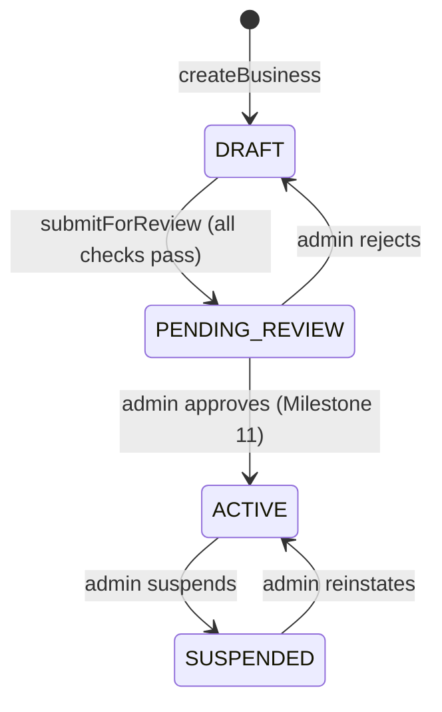

# Providers & storefronts

How a home-services business gets from signing up to being listed, and what
the public marketplace can see.

## The lifecycle

Only `ACTIVE` businesses are publicly visible. Nothing in the provider-facing
code can set `ACTIVE`: `submitForReview` stops at `PENDING_REVIEW`, so a
business cannot list itself unverified. The admin transitions arrive in
Milestone 11; until then the status is moved by hand in `prisma studio`.

## Onboarding

`/onboarding` collects the three things a listing cannot exist without —
name, at least one trade, at least one city — and creates the business, the
creator's OWNER seat, the trades, and the coverage areas in **one
transaction**. A business with no owner would be permanently unreachable,
because membership is the only way in.

The public slug is derived from the name (`slugify`), deduplicated with a
`-2`, `-3` suffix, and validated against a reserved list (`admin`, `api`,
`pro`, …) so a storefront can never shadow a real route. Uniqueness is
ultimately enforced by the database: `createBusiness` retries on a unique
violation, which is what makes two people registering the same business name
at the same moment safe.

`(app)/layout.tsx` redirects any signed-in user without a membership to
`/onboarding`, so the provider app is never rendered without a business.

## The readiness checklist

`storefrontReadiness()` returns five checks, and `submitForReview()` refuses
until all five pass:

| Check        | Passes when                        |
| ------------ | ---------------------------------- |
| `profile`    | `about` and `phone` are set        |
| `categories` | at least one trade                 |
| `areas`      | at least one service area          |
| `licence`    | a `LICENCE` document is on file    |
| `insurance`  | an `INSURANCE` document is on file |

The same function drives the `/storefront` checklist UI and the server-side
gate, so what a provider sees and what the server enforces cannot drift.

## Authorization

`src/server/businesses/access.ts` is the only place membership is resolved,
and every service function starts with one of its three gates:

| Gate                | Allows       | Used for                               |
| ------------------- | ------------ | -------------------------------------- |
| `requireMembership` | any member   | reads                                  |
| `requireEditor`     | OWNER, ADMIN | profile, areas, trades, documents      |
| `requireOwner`      | OWNER        | irreversible and billing-level actions |

Two deliberate choices:

- **Non-members get `NotFoundError`, not a permission error.** A stranger
  should not be able to learn that a business id exists.
- **Deletes and updates are scoped by `businessId` in the query**, not just
  guarded beforehand. Passing another business's record id is a silent no-op
  rather than a cross-tenant write.

`currentMembership()` returns the caller's _oldest_ membership. Multiple
memberships are possible in the schema but there is no switcher yet; picking
the oldest keeps the answer stable across requests instead of varying with
row order.

## Verification documents

Licences and certificates of insurance are private — they are never served
from a public URL and never exposed by the marketplace queries.

- **Narrower allowlist than general uploads**: PDF, PNG, JPEG, WebP only. A
  credential is a document or a photo, never a spreadsheet.
- **The bytes decide the type.** The browser-supplied MIME type is ignored;
  `file-type` sniffs magic bytes and the result must match the extension. A
  renamed executable is rejected before it reaches storage.
- **Storage keys are generated** (`business/<businessId>/<uuid>.<ext>`) — the
  uploaded filename never reaches a path. It is kept only as a display title,
  stripped of control characters and truncated.
- **No orphans.** If the database insert fails after the bytes are stored,
  the object is deleted before the error propagates.
- **Uploads are rate limited** per user (`RATE_LIMITS.upload`, Redis).

### Endpoints

| Route                 | Method | Purpose                                          |
| --------------------- | ------ | ------------------------------------------------ |
| `/api/documents`      | POST   | Multipart upload (`file`, `kind`, `expiresAt?`)  |
| `/api/documents/[id]` | GET    | Download, proxied so authorization is re-checked |

The download handler always responds `Content-Disposition: attachment` and
`X-Content-Type-Options: nosniff`, so an uploaded file can never execute in
our origin. `businessId` is taken from the caller's session — never from the
request body.

Status codes: `401` signed out, `403` no business, `429` rate limited (with
`Retry-After`), `400` invalid input or rejected file, `413` too large, `404`
unknown or another business's document.

## Public marketplace

`src/server/businesses/public.ts` holds every unauthenticated read. All of
them apply `PUBLIC_FILTER` (`status: ACTIVE`) and select an explicit column
list, so internal fields (`id`, `status`, `insuredUntil`, document rows)
cannot leak through a relation.

| Route         | Shows                                                   |
| ------------- | ------------------------------------------------------- |
| `/browse`     | Search by city + province, optionally narrowed by trade |
| `/pro/[slug]` | One storefront; 404 for anything not `ACTIVE`           |

City and province are matched case-insensitively so `/browse?city=surrey` and
`?city=Surrey` behave the same. Both parts of a location are required — a
bare city name matches the wrong province often enough to be worse than
returning nothing. Provider-supplied websites are validated to `http`/`https`
at the schema level and rendered with `rel="nofollow noopener noreferrer"`.
